# 寻慧桌面小精灵 v2 架构分析报告

---

## 一、项目概述

**寻慧桌面小精灵**是一款基于 Electron 框架开发的桌面虚拟宠物应用，具有语音交互、AI对话、游戏娱乐等功能。项目已完成深度重构，实现了模块化、可维护的代码架构。

---

## 二、整体架构

### 2.1 架构层次图

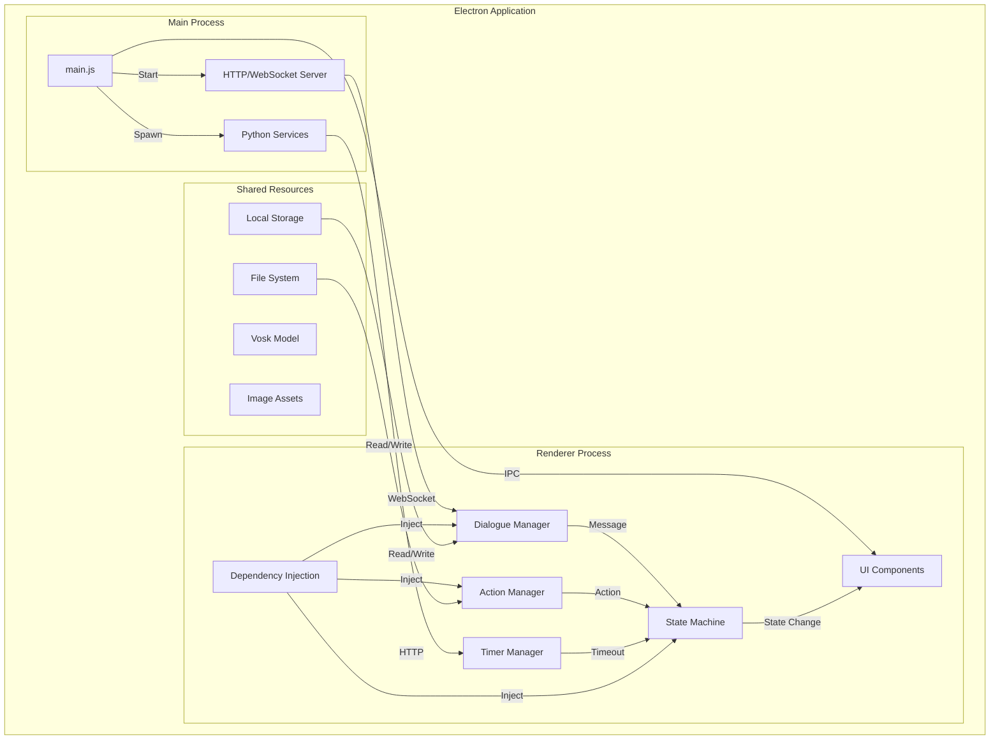

### 2.2 模块架构图

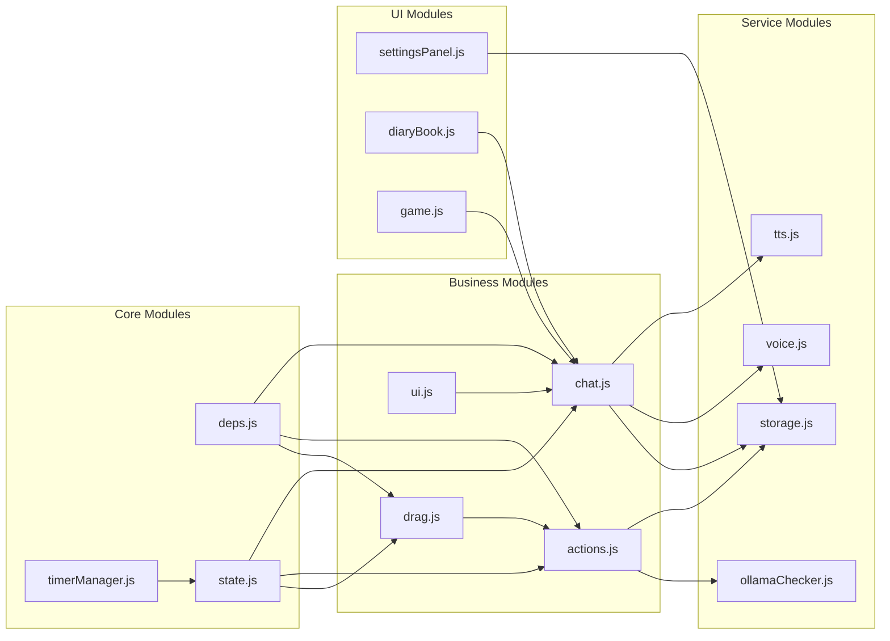

---

## 三、模块职责矩阵

| 模块 | 职责描述 | 复杂度 | 状态 |
|------|----------|--------|------|
| **timerManager.js** | 全局定时器分组管理，防止内存泄漏 | 低 | ✅ 优秀 |
| **deps.js** | 依赖注入封装，安全访问系统能力 | 低 | ✅ 优秀 |
| **state.js** | 状态机管理，控制精灵行为流转 | 中 | ✅ 良好 |
| **chat.js** | AI对话逻辑，命令拦截与响应生成 | 高 | ✅ 良好 |
| **actions.js** | 动作执行引擎，PPT生成等核心功能 | 高 | ⚠️ 需优化 |
| **drag.js** | 拖拽交互，饥饿定时器管理 | 中 | ✅ 良好 |
| **ui.js** | UI组件管理，气泡与输入框 | 中 | ✅ 良好 |
| **tts.js** | 语音合成，Edge-TTS + 浏览器降级 | 中 | ✅ 良好 |
| **voice.js** | 语音识别，Vosk离线识别 | 中 | ✅ 良好 |
| **storage.js** | 数据持久化，日记/历史/学习数据 | 中 | ✅ 良好 |
| **reminders.js** | 提醒服务，定时任务管理 | 中 | ✅ 良好 |
| **affection.js** | 好感度系统，关系进度管理 | 低 | ✅ 良好 |

---

## 四、核心模块深度分析

### 4.1 timerManager.js — 全局定时器管理

**设计模式**: Registry Pattern

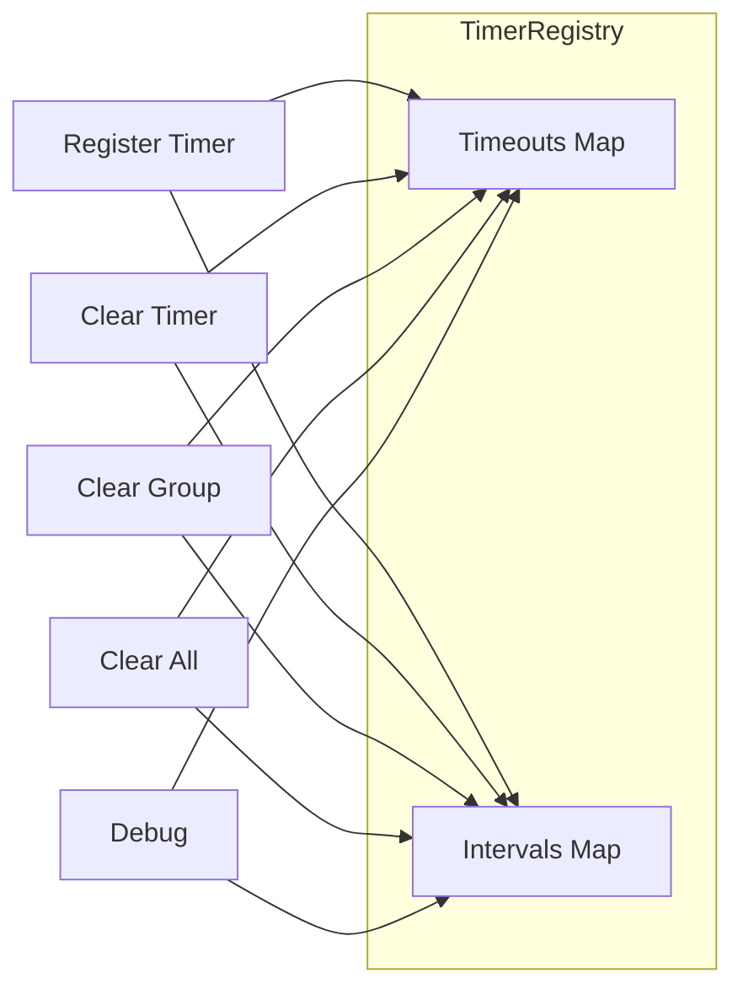

**核心数据结构**:
```javascript
const _timeouts = new Map(); // Map<groupName, Set<timerId>>
const _intervals = new Map();
```

**设计亮点**:
- 定时器执行后自动从集合移除
- 支持分组批量清理
- 内置调试方法便于排查泄漏

---

### 4.2 deps.js — 依赖注入层

**设计模式**: Singleton + Lazy Loading

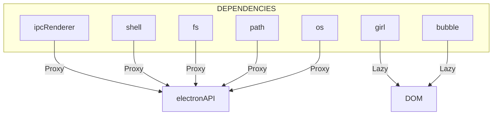

**安全设计**:
- 所有系统能力通过 `window.electronAPI` 代理
- DOM 元素采用惰性获取模式
- 避免直接暴露 Node.js 模块

---

### 4.3 state.js — 状态机

**状态流转图**:

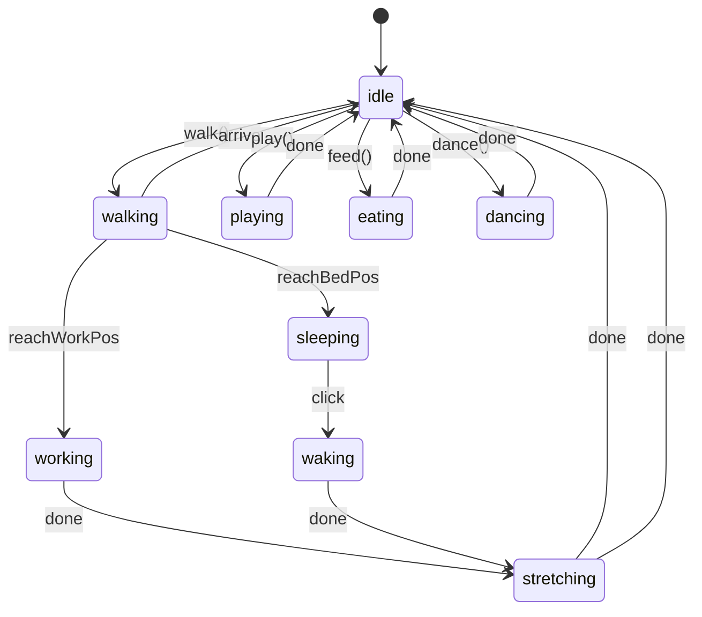

**状态转换规则**:

| 原状态 | 目标状态 | 触发条件 |
|--------|----------|----------|
| idle | walking | 调用 walk() |
| walking | working | 到达工作位置 |
| walking | sleeping | 到达床位 |
| working | stretching | 工作完成 |
| sleeping | waking | 用户点击 |
| waking | stretching | 苏醒动画完成 |
| stretching | idle | 伸懒腰完成 |

---

### 4.4 chat.js — 对话管理器

**对话处理流程**:

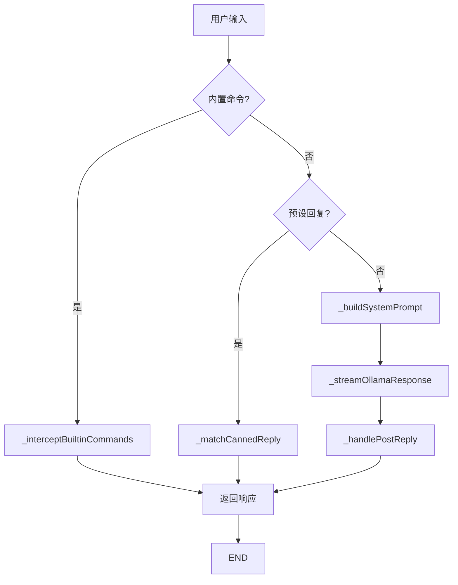

**命令拦截体系**:

| 命令类型 | 示例 | 处理模块 |
|----------|------|----------|
| 提醒 | "提醒我下午3点开会" | reminders.js |
| 音乐 | "播放音乐" | Netease API |
| 搜索 | "搜索天气" | Web Search |
| 报时 | "现在几点" | Date API |
| 日期 | "今天几号" | Date API |

---

## 五、设计模式应用

| 模式 | 应用位置 | 实现价值 |
|------|----------|----------|
| **Singleton** | deps.js, timerManager.js | 全局唯一实例，避免重复创建 |
| **Registry** | timerManager.js | 分组管理，便于批量清理 |
| **Dependency Injection** | deps.js | 解耦依赖，便于测试 |
| **State Machine** | state.js | 管理复杂状态转换 |
| **Strategy** | chat.js 命令拦截 | 不同命令不同策略 |
| **Template Method** | actions.js | 统一动作执行框架 |

---

## 六、技术亮点

### 6.1 稳定性保障

**TTS 多级降级**:
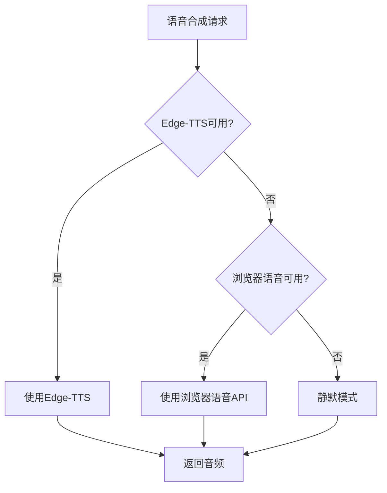

**定时器生命周期管理**:
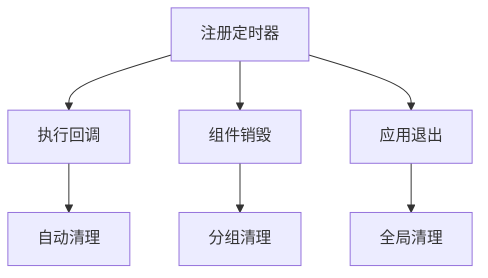

### 6.2 安全架构

**IPC 白名单机制**:
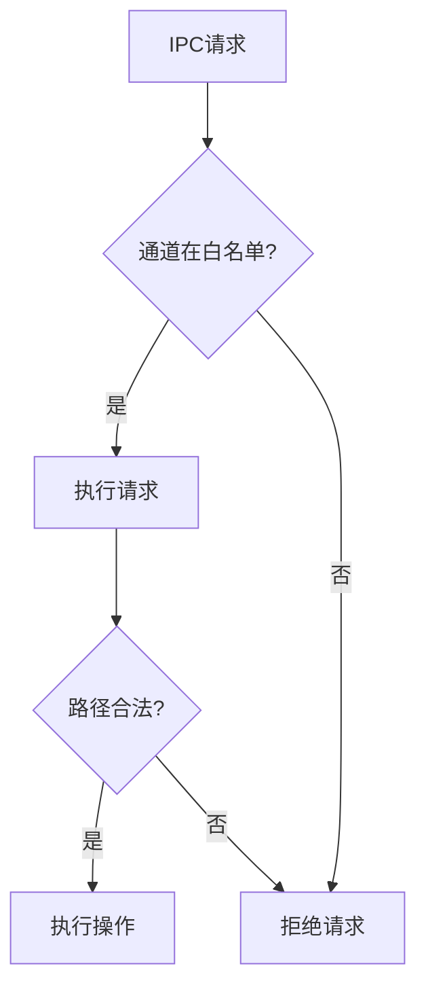

---

## 七、代码质量评估

### 7.1 架构评分

| 维度 | 评分 | 说明 |
|------|------|------|
| 整体架构 | **85/100** | 模块化清晰 |
| 代码质量 | **80/100** | 注释详细 |
| 可维护性 | **82/100** | 易于修改 |
| 稳定性 | **88/100** | 降级方案完善 |
| 安全性 | **85/100** | 白名单机制 |

### 7.2 待改进项

| 优先级 | 问题 | 位置 | 建议 |
|--------|------|------|------|
| P0 | 状态枚举硬编码 | state.js | 提取为常量对象 |
| P1 | PPT生成逻辑过长 | actions.js | 拆分为独立模块 |
| P1 | 重复样式设置 | index.js | 提取工具函数 |
| P2 | 缺乏单元测试 | 全局 | 引入测试框架 |

---

## 八、架构改进建议

### 8.1 短期优化

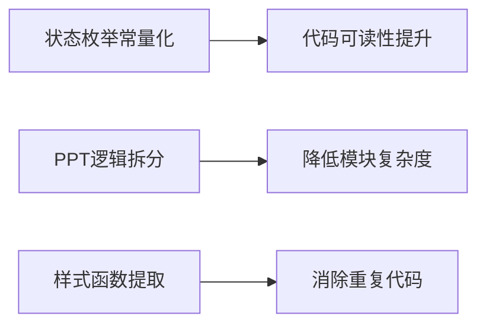

### 8.2 中长期规划

| 方向 | 建议 | 预期收益 |
|------|------|----------|
| **测试覆盖** | 引入 Jest/Vitest | 提升代码可靠性 |
| **类型安全** | 迁移到 TypeScript | 减少运行时错误 |
| **状态管理** | 引入 Pinia/Zustand | 更规范的状态管理 |
| **插件化** | 动作模块设计为插件 | 支持功能扩展 |
| **监控** | 集成性能监控 | 便于问题排查 |

---

## 九、总结

**寻慧桌面小精灵 v2** 展现了优秀的工程实践：

1. **架构演进意识**：从单体代码逐步重构为模块化架构
2. **问题驱动开发**：每个重构都针对具体问题
3. **防御性编程**：完善的异常处理和降级方案
4. **可观测性**：内置调试工具和日志记录

### 核心价值

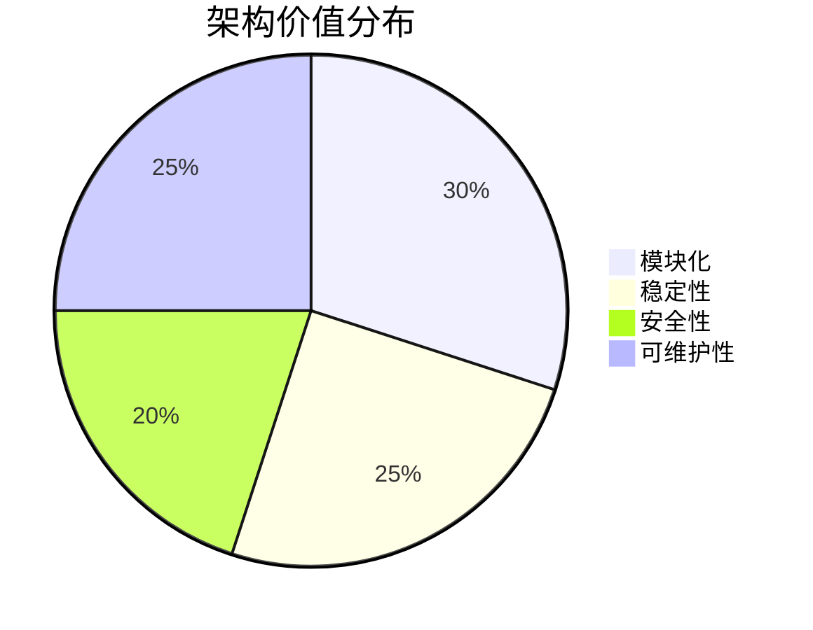

---

**文档版本**: v1.0  
**分析日期**: 2026-05-21  
**分析范围**: `v2/src/renderer/` 核心模块