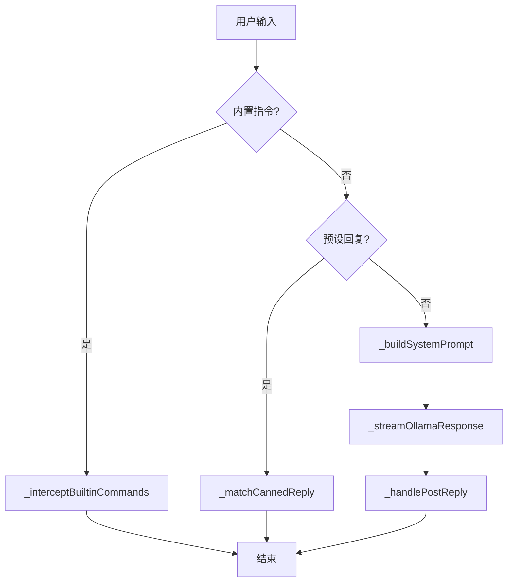
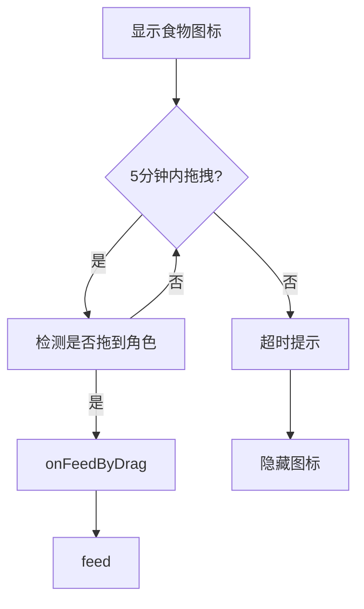
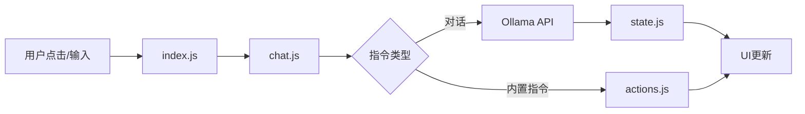
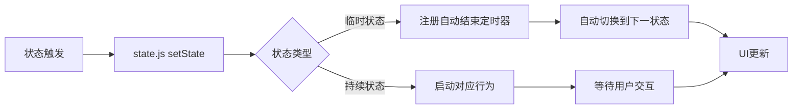
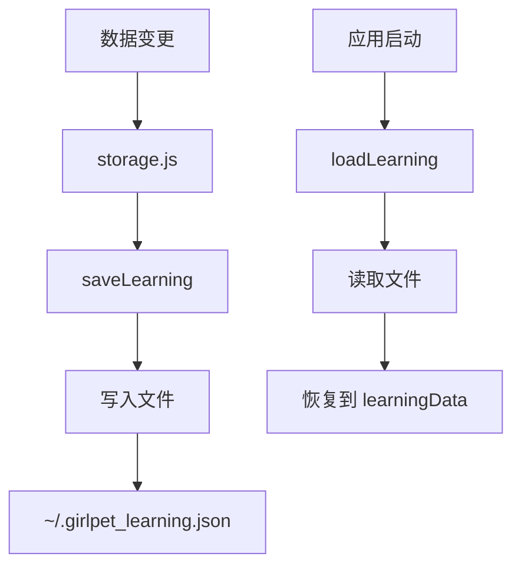

# 寻慧桌面小精灵 v2 代码解读文档

---

## 一、项目架构概览

### 1.1 整体架构图

```
┌─────────────────────────────────────────────────────────────────────────┐
│                        Electron 应用架构                               │
├─────────────────────────────────────────────────────────────────────────┤
│                                                                         │
│  ┌─────────────────┐                    ┌─────────────────────────┐    │
│  │   Main Process  │  IPC Communication │    Renderer Process     │    │
│  │   (main.js)     │◄─────────────────►│   (src/renderer/*.js)   │    │
│  └────────┬────────┘                    └───────────┬─────────────┘    │
│           │                                         │                   │
│           ▼                                         ▼                   │
│  ┌─────────────────┐                    ┌─────────────────────────┐    │
│  │  Python Services│                    │    UI Components        │    │
│  │  Edge-TTS (8001)│                    │  Girl Sprite + Bubbles │    │
│  │  Netease API(3000)│                   │  Settings Panel        │    │
│  │  HTTP Server(8080)│                   │  Diary Book UI         │    │
│  │  WebSocket(8083) │                   │                        │    │
│  └─────────────────┘                    └─────────────────────────┘    │
│                                                                         │
└─────────────────────────────────────────────────────────────────────────┘
```

### 1.2 模块职责总览

| 模块 | 文件 | 核心职责 | 难度 |
|------|------|----------|------|
| **入口模块** | `index.js` | 应用初始化、生命周期管理 | 低 |
| **状态机** | `state.js` | 角色状态管理、行为控制 | 高 |
| **对话模块** | `chat.js` | AI交互、命令处理 | 高 |
| **动作模块** | `actions.js` | 具体行为执行（喂食/工作/玩耍） | 中 |
| **存储模块** | `storage.js` | 数据持久化、记忆管理 | 中 |
| **依赖注入** | `deps.js` | 系统能力封装 | 低 |
| **定时器管理** | `timerManager.js` | 全局定时器、防泄漏 | 低 |
| **UI模块** | `ui.js` | 气泡显示、界面交互 | 中 |
| **拖拽模块** | `drag.js` | 拖拽喂食、饥饿管理 | 中 |
| **配置模块** | `config.js` | 常量配置 | 低 |

---

## 二、核心模块详解

### 2.1 入口模块：index.js

**核心职责**：应用启动初始化、全局事件监听

**关键函数**：

```javascript
function init() {
    // 1. 加载存储数据
    window.STORAGE.loadLearning();
    window.STORAGE.loadHistory();
    
    // 2. 初始化 UI 组件
    _initToggleBtn();  // 眼睛按钮
    
    // 3. 启动状态机
    window.STATE.startAutoSleepCheck();
    window.STATE.startRandomPlay();
}
```

**眼睛按钮逻辑**（`_initToggleBtn`）：
- 点击切换角色可见性
- 位置保护机制：每秒检查按钮是否在屏幕内
- 自动调整到最近的角落

---

### 2.2 状态机：state.js

**核心职责**：管理角色的状态流转和行为逻辑

**状态定义**：

| 状态 | 说明 | 自动结束 |
|------|------|----------|
| `idle` | 空闲状态 | 10分钟后自动睡觉 |
| `walking` | 行走中 | 到达目标后自动切换 |
| `working` | 工作中 | 3秒后 → stretching |
| `sleeping` | 睡眠中 | 到时间自动醒来 |
| `waking` | 苏醒中 | 2.5秒后 → stretching |
| `stretching` | 伸懒腰 | 2秒后 → idle |
| `playing` | 玩耍中 | 5秒后 → idle |
| `eating` | 吃东西 | 由 feed() 控制 |
| `dancing` | 跳舞 | 4秒后 → idle |

**状态流转图**：

```mermaid
stateDiagram-v2
    idle --> walking : startWalking
    walking --> idle : arrive
    walking --> working : arriveWork
    walking --> sleeping : arriveBed
    
    working --> stretching : finish (3s)
    sleeping --> waking : wake
    waking --> stretching : finish (2.5s)
    stretching --> idle : finish (2s)
    
    idle --> playing : startPlaying
    playing --> idle : finish (5s)
    
    idle --> eating : startEating
    eating --> idle : finish
    
    idle --> dancing : startDancing
    dancing --> idle : finish (4s)
```



**核心函数：setState**

```javascript
function setState(newState) {
    // 1. 检查状态切换豁免条件
    // 2. 清除上一个状态的自动结束定时器
    // 3. 更新状态、切换动画、处理音频
    // 4. 注册新状态的自动结束定时器
}
```

**状态保护机制**：
- 状态切换最小间隔：10分钟（`minDuration`）
- 防止状态频繁切换导致动画混乱

---

### 2.3 对话模块：chat.js

**核心职责**：处理用户输入、调用AI生成回复

**处理流程**：



**内置指令类型**：

| 指令类型 | 示例 | 处理函数 |
|----------|------|----------|
| 提醒 | "提醒我下午3点开会" | `parseRemindTime()` |
| 音乐 | "播放音乐" | `playMusicOnline()` |
| 搜索 | "搜索天气" | `searchWeb()` |
| 报时 | "现在几点" | `aiTellTime()` |
| 日期 | "今天几号" | 直接回复 |
| 生日 | "你的生日是哪天" | 查询存储的生日 |

**系统提示词构建**（`_buildSystemPrompt`）：

```javascript
return {
    role: 'system',
    content: `我是寻慧，一个有独立人格的傲娇毒舌桌面小精灵。
    - 回复必须语法正确、语句通顺
    - 高频使用"哼"、"白痴"、"笨蛋"等词
    - 回复短小精悍，不超过30字
    - 当前状态：${affectionPhase}阶段
    - 指导准则：${affectionHints[affectionPhase]}`
};
```

**回复后处理**（`_handlePostReply`）：
1. 毒舌表情切换（显示嫌弃脸）
2. 内心戏气泡（傲娇反差）
3. 记录对话到学习数据
4. 触发后续动作（工作/睡觉/玩耍）

---

### 2.4 动作模块：actions.js

**核心职责**：执行具体的角色行为

**主要动作函数**：

| 函数 | 功能 | 状态要求 |
|------|------|----------|
| `goToWork()` | 去工作 | 非 walking/sleeping/waking |
| `goToBed()` | 去睡觉 | 非 walking/sleeping/waking |
| `play()` | 玩耍 | 非 walking/sleeping/waking |
| `feed()` | 喂食 | 非 walking/sleeping |
| `dance()` | 跳舞 | 随机触发 |
| `sarcasticFeed()` | 毒舌喂食 | 先吐槽再喂食 |

**喂食流程**（`feed()`）：

```javascript
function feed() {
    // 1. 设置状态为 eating
    s.setState('eating');
    
    // 2. 构建 AI 提示词，根据好感度调整态度
    const prompt = `那个笨蛋递来一份食物...请傲娇地回应`;
    
    // 3. 调用 AI 生成回复
    window.CHAT.talkToOllama(prompt);
    
    // 4. 自动日记记录
    window.STORAGE.autoDiary('feed');
    
    // 5. 好感度 +2
    window.AFFECTION.change(+2, '喂食');
}
```

---

### 2.5 存储模块：storage.js

**核心职责**：数据持久化、记忆管理

**数据结构**：

```javascript
learningData = {
    dialog: {},                    // 对话记忆
    gomoku: { stats: {...} },      // 五子棋战绩
    checkers: { stats: {...} },    // 跳棋战绩
    emotion: { stats: {...} },     // 情感偏好
    userProfile: {                 // 用户画像
        gender: '',               // 'male' | 'female'
        birthday: ''              // 'MM-DD'
    },
    girlProfile: {                // 角色画像
        birthday: ''
    },
    affection: {                  // 好感度
        value: 50,
        lastChange: 0,
        cooldown: 60000
    },
    lastGame: {                   // 最近游戏记录
        game: null,
        result: null,
        timestamp: 0
    }
};
```

**记忆匹配机制**（`getCannedReply`）：
1. **精确匹配**：完全相同的问题
2. **模糊匹配**：关键词重叠度 ≥ 50%

```javascript
// 相似度计算
const commonWords = keyWords.filter(w => inputWords.includes(w));
if (commonWords.length / maxLength >= 0.5) {
    // 模糊匹配成功
}
```

---

### 2.6 依赖注入：deps.js

**核心职责**：安全封装系统能力，避免直接暴露 Node.js 模块

**封装的能力**：

| 模块 | 方法 | 说明 |
|------|------|------|
| `ipcRenderer` | `invoke`, `send`, `on` | 进程间通信 |
| `shell` | `openExternal` | 打开外部链接 |
| `fs` | `existsSync`, `readFileSync`, `writeFileSync` | 文件系统操作 |
| `path` | `join`, `basename` | 路径处理 |
| `os` | `homedir`, `tmpdir` | 操作系统信息 |

**惰性获取模式**：

```javascript
get girl() { 
    return _girl || (_girl = document.getElementById('girl')); 
}
```

---

### 2.7 定时器管理：timerManager.js

**核心职责**：统一管理定时器，防止内存泄漏

**设计模式**：Registry Pattern

```javascript
const _timeouts = new Map();  // Map<groupName, Set<timerId>>
const _intervals = new Map();

// 注册定时器时自动加入对应分组
TimerManager.setTimeout('hunger', fn, delay);

// 组件销毁时批量清理
TimerManager.clearGroup('hunger');
```

**防止泄漏机制**：
- setTimeout 执行后自动从集合中移除
- 提供 `clearGroup()` 批量清理
- 提供 `debug()` 查看活跃定时器数量

---

### 2.8 UI模块：ui.js

**核心职责**：气泡显示、位置计算、界面交互

**气泡位置算法**（`getBestBubblePosition`）：

```javascript
// 尝试四个位置：上、下、左、右
const positions = [
    { x: 上方居中 },
    { x: 下方居中 },
    { x: 左侧居中 },
    { x: 右侧居中 }
];

// 优先选择不遮挡角色的位置
// 如果都遮挡，默认显示在角色上方
```

**气泡显示流程**（`showBubble`）：
1. 计算最佳位置
2. 显示气泡内容
3. 触发 TTS 语音
4. 定时自动隐藏

---

### 2.9 拖拽模块：drag.js

**核心职责**：拖拽喂食交互、饥饿管理

**拖拽流程**：



**饥饿管理**：
- 饥饿间隔：5~15分钟（随机）
- 超时未喂食：显示傲娇提示
- 喂食后：重置饥饿计时器

---

### 2.10 配置模块：config.js

**核心职责**：集中管理所有配置常量

**配置项分类**：

| 配置项 | 说明 | 默认值 |
|--------|------|--------|
| `imgMap` | 动画图片路径 | `{ idle: 'images/idle.gif', ... }` |
| `FILE_PATHS` | 数据文件路径 | 存放在用户主目录 |
| `STATE_CONFIG` | 状态参数 | minDuration: 10分钟 |
| `SLEEP_CONFIG` | 睡眠参数 | 22:00 ~ 07:00 |
| `GAME_REACTIONS` | 游戏胜负反应 | 傲娇吐槽 |
| `PLAY_ACTIONS` | 玩耍动作列表 | 5种随机动作 |
| `DIARY_ACTIONS` | 日记模板 | 自动生成日记内容 |

---

## 三、数据流分析

### 3.1 用户输入数据流



### 3.2 状态变更数据流



### 3.3 数据持久化流程



---

## 四、关键设计模式

### 4.1 应用的设计模式

| 模式 | 应用位置 | 实现价值 |
|------|----------|----------|
| **Singleton** | `deps.js`, `timerManager.js` | 全局唯一实例，避免重复创建 |
| **Registry** | `timerManager.js` | 分组管理，便于批量清理 |
| **State Machine** | `state.js` | 管理复杂状态转换逻辑 |
| **Strategy** | `chat.js` | 不同指令采用不同处理策略 |
| **Dependency Injection** | `deps.js` | 解耦依赖，便于测试和替换 |
| **Template Method** | `actions.js` | 统一动作执行框架 |
| **Lazy Loading** | `deps.js` | 延迟初始化，提升启动性能 |

---

## 五、调试与维护

### 5.1 常用调试命令

```javascript
// 在开发者工具控制台执行：

// 查看当前状态
console.log(window.STATE.state);

// 查看活跃定时器
TimerManager.debug();

// 查看学习数据
console.log(window.STORAGE.getLearningData());

// 查看好感度
console.log(window.AFFECTION.getValue());

// 查看对话历史
console.log(window.STORAGE.getHistory());

// 强制切换状态
window.STATE.setState('playing');

// 触发喂食
window.ACTIONS.feed();
```

### 5.2 日志输出说明

| 日志前缀 | 模块 | 说明 |
|----------|------|------|
| `[State]` | state.js | 状态变更 |
| `[STORAGE]` | storage.js | 存储操作 |
| `[TimerManager]` | timerManager.js | 定时器管理 |
| `[chat]` | chat.js | 对话处理 |
| `[Sleep]` | state.js | 睡眠检查 |

### 5.3 常见问题排查

| 问题 | 排查方向 |
|------|----------|
| 角色不动 | 检查状态是否为 idle，查看 `window.STATE.state` |
| 不说话 | 检查 Ollama 服务是否启动，查看网络请求 |
| 内存泄漏 | 使用 `TimerManager.debug()` 检查定时器数量 |
| 数据丢失 | 检查 `~/.girlpet_learning.json` 文件是否存在 |

---

## 六、扩展开发指南

### 6.1 添加新状态

1. 在 `config.js` 中添加图片路径
2. 在 `state.js` 中的 `TRANSITIONS` 添加状态转换规则
3. 在 `setState` 中添加状态处理逻辑
4. 在 `actions.js` 中添加触发函数

### 6.2 添加新指令

1. 在 `chat.js` 的 `_interceptBuiltinCommands` 中添加新的正则匹配
2. 实现处理函数
3. 添加到 `actions.js` 中并导出

### 6.3 修改角色性格

1. 修改 `chat.js` 中的系统提示词
2. 调整 `config.js` 中的反应配置
3. 修改好感度阶段描述

手机端连接电脑方式：手机浏览器打开，输入：http://电脑端IP4地址:8080
---

**文档版本**: v1.0  
**生成日期**: 2026-05-22  
**适用版本**: GirlPet v2